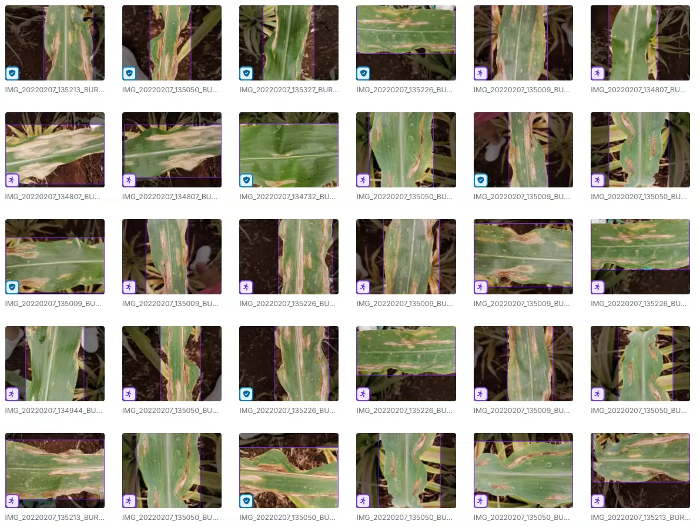
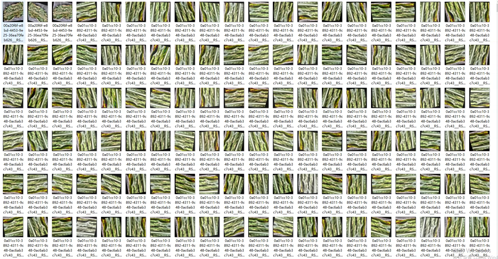
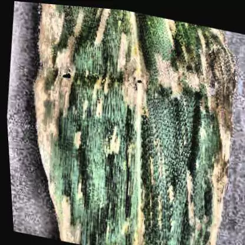
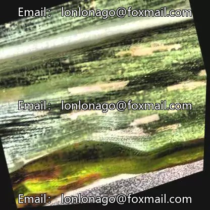
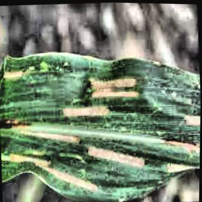
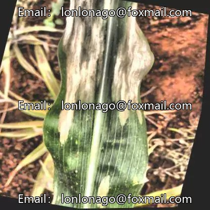

## Body

（Agricultural Product）Corn Leaf Disease Target Detection Dataset in YOLO format

Totally 6 thousand images, each labeled separately.
Divided into three categories, namely Corn Rust', 'Grey Leaf Spot', 'Leaf Blight' - Corn rust, grey leaf spot, and leaf blight.

YOLO format, divided into training set, test set, validation set.

Electronic virtual products are not returnable after sale.

## Images

Here is a pay link on Stripe ( https://buy.stripe.com/3cs8yP7sY87d0vu9AB ). Please contact me lonlonago@foxmail.com after funding $89, and I will send you a complete data files , thank you!

